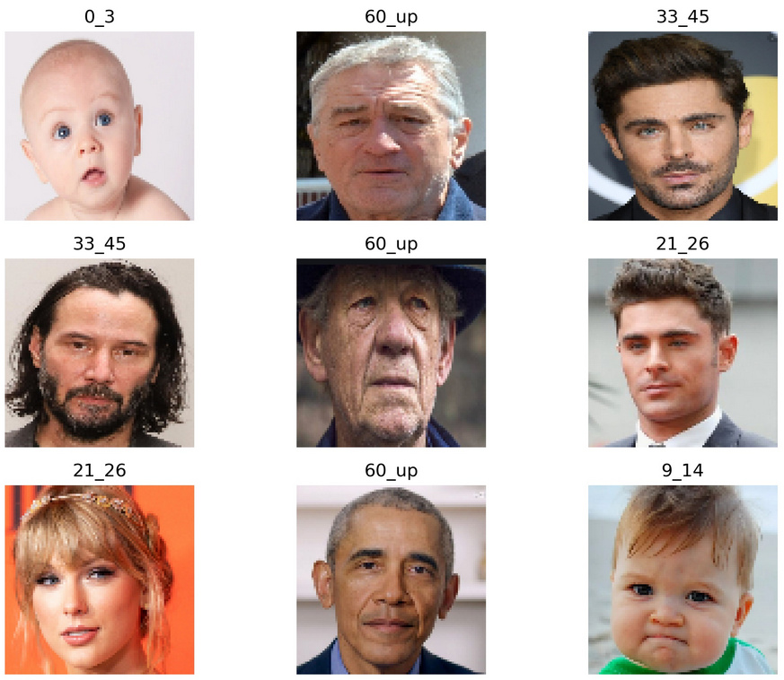

# Age prediction with EfficientNets

- In this project, I trained my a Age classifier with [EfficientNet](https://arxiv.org/abs/1905.11946) which was claimed to achiever better accuracy than than previous ConvNets. I applied transfer learning with __imagenet__ pre-trained weight and add custom layer. During training, I noticed a significant over-fitting trend, thus I added more _Dropout layer_ and apply _several data augmentation techniques_.

- I have created my own dataset consist of 51048 images divided among 9 age groups. However during training process, I realize my dataset is not a good training source since it didn't distributed evenly among age groups. In particularly, my classifier is bias toward the age group of 33-45 and 60 above.

- I also realized a noticeable pattern which can be related to humans' common sens in age classifying. My classifier considers features such as lighter skin, no beard, black hair, etc as indications for younger age while features such as wrinkles, white hair and beards, etc usually return older age-group results. 

- After long hours of training and tuning, I can only manage to achieve maximum 50% accuracy on my validation set, which is not a good result. I also tried with other popular networks as MobileNets, VGG16, ResNet50, Xcepticon but the accuracy were much worse than EfficientNet.

- My dataset can be downloaded from [here](https://drive.google.com/file/d/1q5LROuIN596pdMY3lMRULnM6PENPurou/view?usp=sharing).

  

 

  

 
