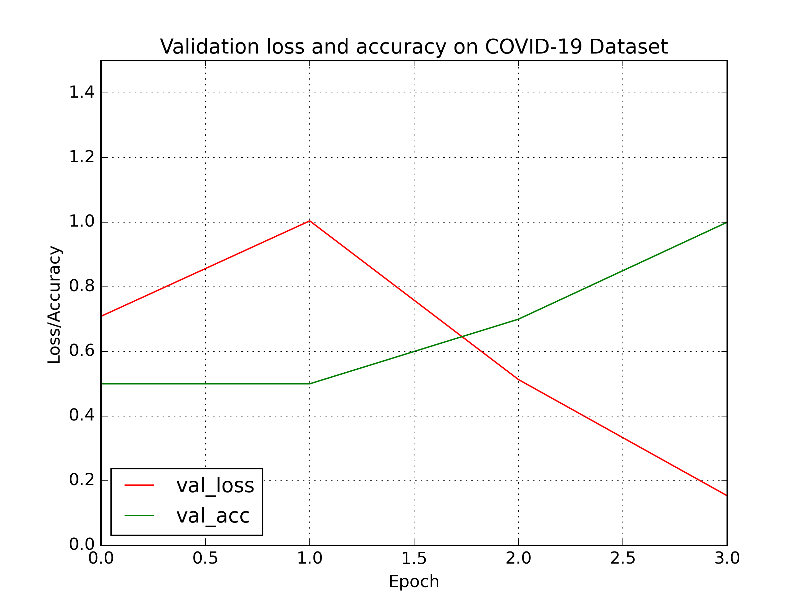
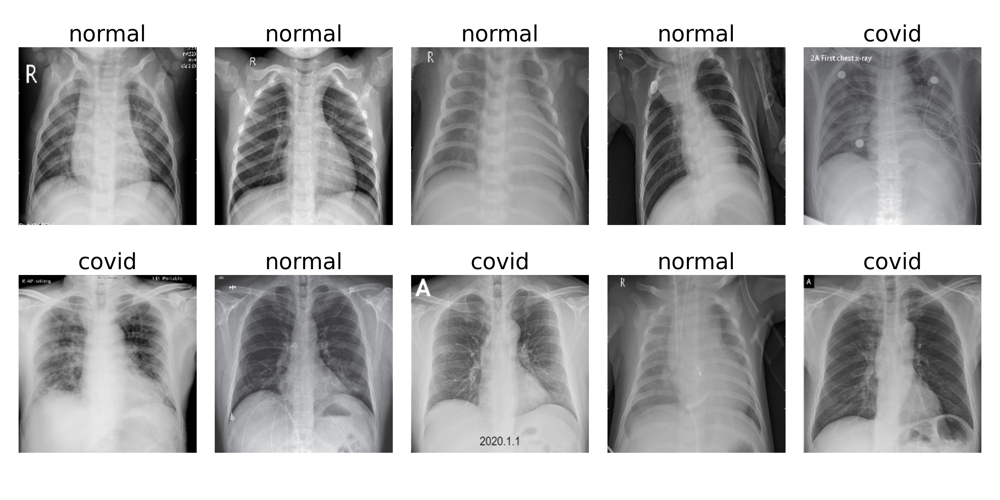

## Detect Covid-19 with X-ray images
The dataset of this project is share by __Dr. Joseph Pau Cohen__ from University of Montreal in an attempt to predict and understand the infection. His repository where I downloaded the dataset can be found [here](https://github.com/ieee8023/covid-chestxray-dataset).

Below are some key points regarding this project:

- The model was train in the dataset of 25 X-ray images of Covid patients and 25 X-ray images of normal patients.
- The model uses Resnet50 as transfer learning model.
- The accuracy of this model is 90%.
- The result are for reference only.

  

 

  

 
