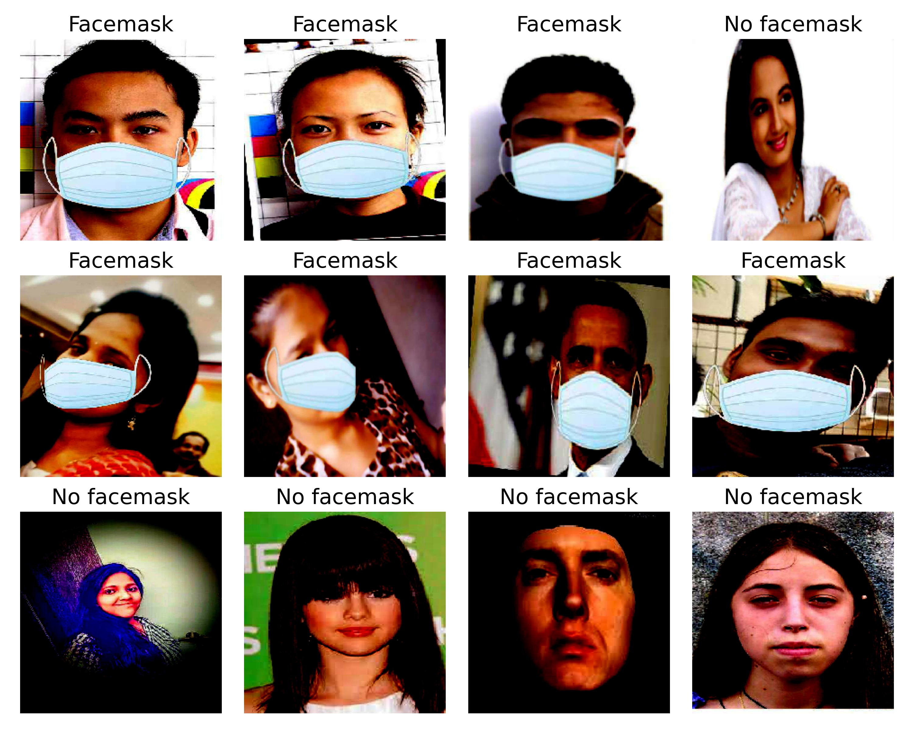
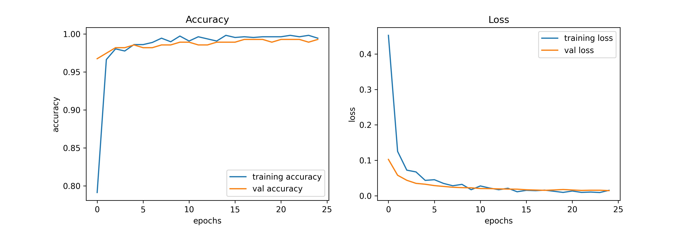

## Facemask detection with Deeplearning and OpenCV

In this project, I have conducted several methods as below:
- Train a model to classify "No mask" and "Mask" status with MobileNets. Accuracy > 98%
- Use pre-train Face detection model to catch faces

