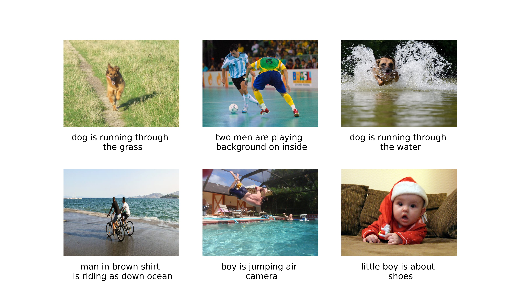

## Image caption generator 

- The idea of this project is to create a Deep Learning model that deliver textual description from given photographs. Thus a combination of different techniques from both __Computer Vision__ and __Natural Langue Processing__ are conducted. 
- I used pre-trained weight on _imagenet_ dataset of __Resnet50__ architecture to extract training features. Later __LSTM__ and __Reset50__ are combined as one deep CNN to train this caption generator model.
- The dataset used for this dataset can be downloaded from [Kaggle](https://www.kaggle.com/hsankesara/flickr-image-dataset).

## Before running this project

1. In order to execute notebook `test_model_image_generators.ipynb` or python script `test_model_image_generators.py`, it is required to conduct several preprocessing stages and train the model in advance. Folder `/preprocess` contains python scripts with function described as below:
    - `extract_image_features.py`: extract features with pre-trained, fine-tune ResNet50 using Imagenet weight from training dataset. All features extracted are save as a pickle file `/preprocess/features.pkl`for later use (the file is not uploaded since it is too heavy)
    - `generate_tokenizer.py`: generate a tokenizer as pickle file `/preprocess/tokenizer.pkl`
    - `preprocess_text_data`: preprocess descriptions of every training image and save them as `/preprocess/descriptions.txt`

1. After obtaining 3 files `features.pkl`, `tokenizer.pkl`,`descriptions.txt` in folder `/preprocess`, run `train.py`to star training model. It should be notice that the training process consume lots of time and computational power (GPU and >8Gb is required). After the training is finished, the entire model and its weight would be save as file `image_captioning_model.h5` (this file is not uploaded since it is too heavy).

 

