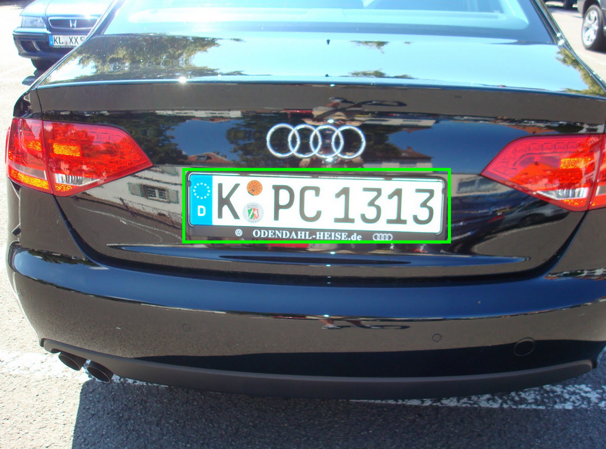
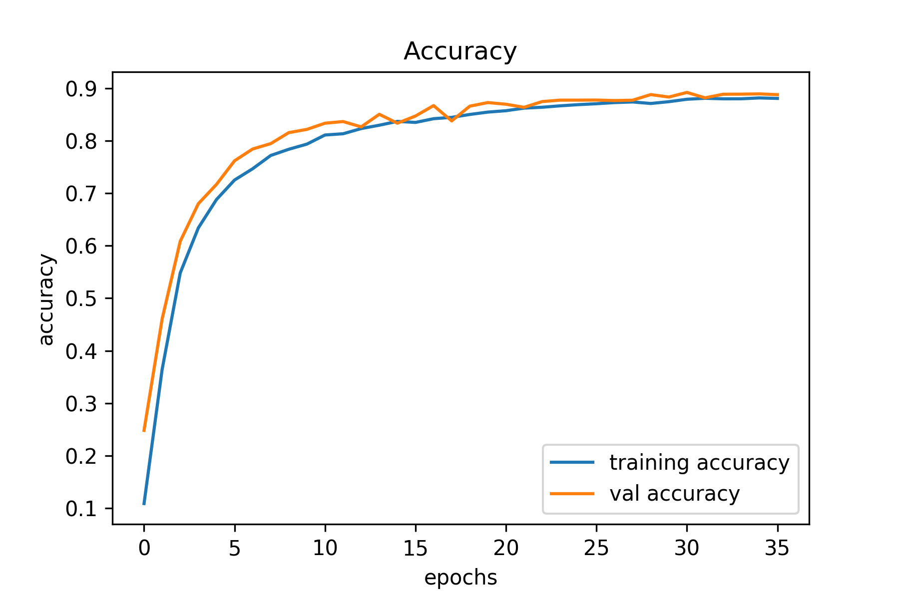
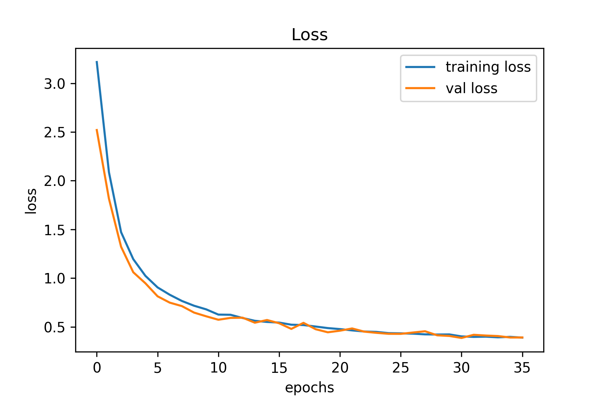
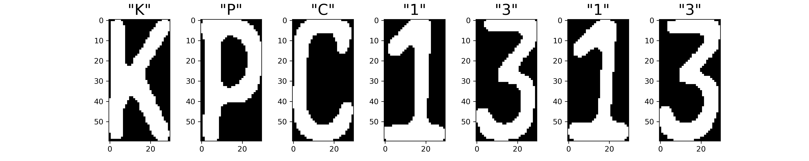
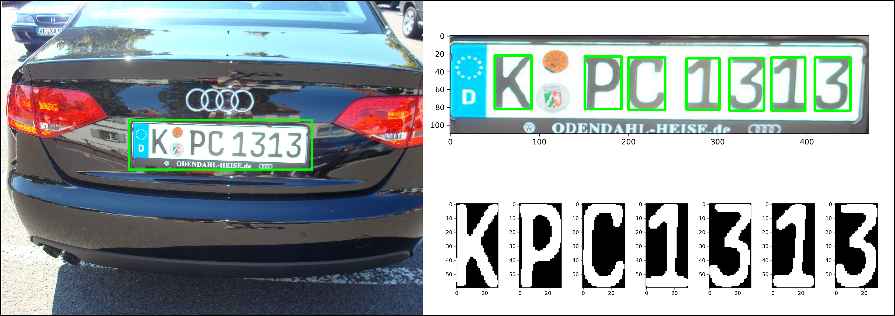

### The methodology to detect and recongize License Plate contains 3 main stages:
  1. Detect and crop the region of License Plate from rear care image using WPOD model
  
  

  
  

  
  2. Using common OpenCV techniques such as blur, threshold, findContour to crop all Plate's digits
  
  

  
  

  
  3. Using a Nvidia model which was trained to recognize plate digits. The accuracy of this training model as well as the result can be seen as below:
  

  
  
  

  

  
  

   
  

  
  

## The End!
