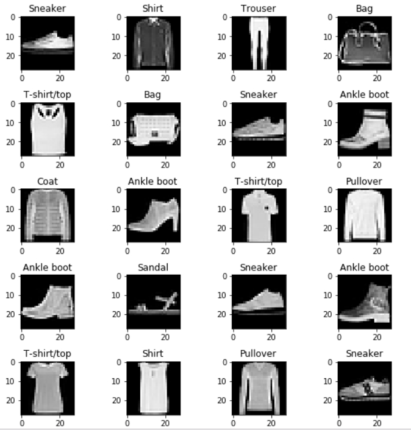
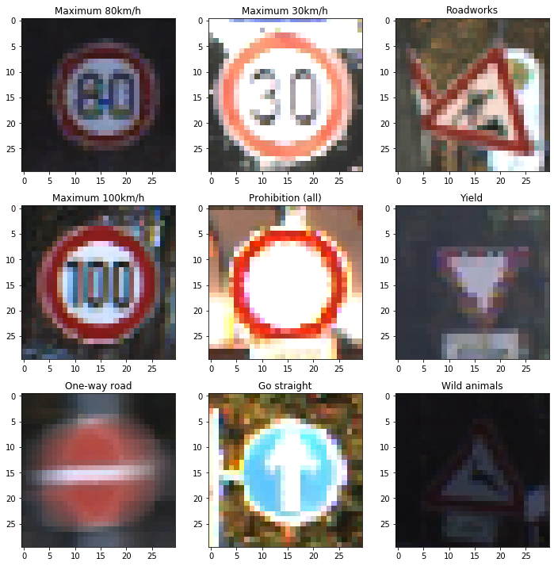
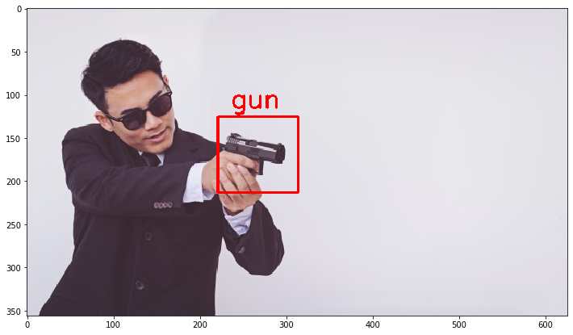

## Machine_learning_projects
This repository contains my projects relating to Machine Learning. To view my notebook directly from Github, you can use [nbviewer](https://nbviewer.jupyter.org/). Belows are brief description and demonstration of my projects:

1. [Dog and cat classification (95% accuracy)](#dog-and-cat-classification)
1. [Fashion classification with fashion_mnnist datasets from Keras (91% accuracy)](#Fashion-classification-with-fashion_mnnist-datasets-from-Keras)
1. [Traffic signs classification with German Traffic Sign dataset on Kaggle (97% accuracy)](#Traffic-signs-classification-with-German-Traffic-Sign-dataset-on-Kaggle)
1. [Object classisfication with YOLOv3](#Object-classification-with-YOLOv3)
1. [Gun detection with YOLOv3](#Gun-detection-with-YOLOv3)
1. [Car brand classification with EfficientNet (70% accuracy)](#Car-brand-classification-with-EfficientNet)
1. [License Plate Detection and Recognition](#License-Plate-Detection-and-Recognition)
1. [Detect COVID-19 from X-ray images](#Detect-COVID-19-from-X-ray-images)
1. [Facemask detection with Deeplearning and OpenCV](#Facemask-detection-with-Deeplearning-and-OpenCV)

### [Dog and Cat classification][1]:
  - [Dataset](http://bit.ly/30k1jgs): this datset contains 25,000 images of dog and cat collected from Internet.
  - My customized model contains 12 layers had achieved accuracy 87.8%. Used transfer learning with pre-trained Resnet50, I have improved my model accuracy up to nearly 98%.

  

 

### [Fashion classification with fashion_mnnist datasets from Keras][2]:
  - Dataset: The fashion_mnist datasets of Keras contains of 60,000 examples and a test set of 10,000 examples
  - My model consists of 597,786 parameters and was trained for 10 epochs. The accuracy is nearly 95%

  

 

### [Traffic signs classification with German Traffic Sign dataset on Kaggle][3]:
  - Dataset: The Kaggle German Traffic Sign dataset consists of 40 classes and more than 50,000 images in total.
  - The mode created in this project contains 478,763 parameter and was trained for 20 epochs. The final accuracy after testing with new test data is 96.8%

  

 

### [Object classification with YOLOv3][4]:
  - Dataset: COCO dataset is a large-scale object-detection dataset which contains of approximately 330K images.
  - In this project, I applied YOLOv3 algorithm on the dataset of COCO and pass an image and video through. The results can be seen as below figures:

  
  

 

### [Gun detection with YOLOv3][5]:
  - [Dataset](http://www.mediafire.com/file/pvfircmboaelkxc/Gun_data_labeled.zip/file): 3k images of hand gun and their label annotation (bounding box coordination)
  - Model was trained on Colab with 900 epochs using Yolov3.

  
  

 

### [Car brand classification with EfficientNet][6]
- [Dataset](https://www.kaggle.com/jutrera/stanford-car-dataset-by-classes-folder): Stanford car dataset which contains of 16k images from 196 classes of car brands
- Model was trained with fine-tune pre-trained EfficientNet and acquire the accuracy of 73%.

  

 

### [License Plate Detection and Recognition][7]:
- In this project, I created a pipeline that detect and read car license plate in Europe. The piple contains three main statges:
1. Detect and crop the region of License Plate from rear care image using WPOD model

1. Using common OpenCV techniques such as blur, threshold, findContour to crop all Plate's digits

1. Using a Nvidia model which was trained to recognize plate digits. 

 

### [Detect COVID-19 from X-ray images][8]
The dataset of this project is share by **Dr. Joseph Pau Cohen** from University of Montreal in an attempt to predict and understand the infection. His repository where I downloaded the dataset can be found [here](https://github.com/ieee8023/covid-chestxray-dataset).

Below are some key points regarding this project:

  1. The model was train in the dataset of 25 X-ray images of. Covid patients and 25 X-ray images of normal patients.
  1. The model uses Resnet50 as transfer learning model.
  1. The accuracy of this model is 90%.
  1. The result are for reference only.

  

 

### [Facemask detection with Deeplearning and OpenCV][9]
In this project, I have conducted several methods as below:
  - Train a model to classifiy "No mask" and "Mask" status with MobileNets. Accuracy > 98%
  - Use pre-train Face detection model to catch faces

 

[1]:/Dog_Cat_classification
[2]:/Fashion_classification
[3]:/Traffic_signs_classification
[4]:/Object_classification_Yolov3
[5]:/Gun_detection_Yolov3
[6]:/Car_brand_classification
[7]:/License_Plate_Detection_and_Recognition
[8]:/Detect_COVID-19_in_X-ray
[9]:/Face_mask_detection
