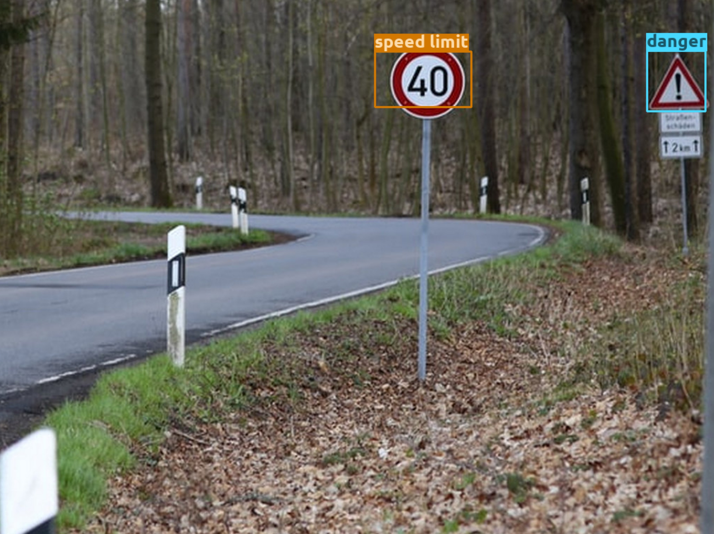
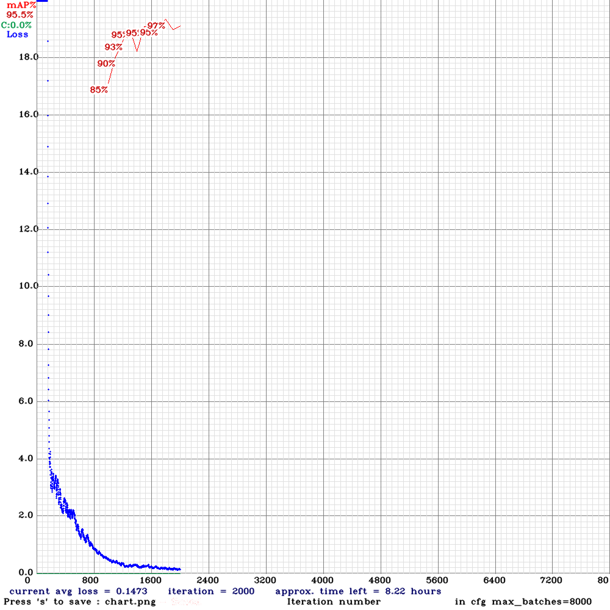

## Traffic signs detection with YOLOv4 and OpenCV

</img>

 

</img>

## Training result

</img>

## Read the Article
[YOLOv4 on Google Colab: Train your Custom Dataset (Traffic signs) with ease](https://towardsdatascience.com/yolov4-in-google-colab-train-your-custom-dataset-traffic-signs-with-ease-3243ca91c81d)
